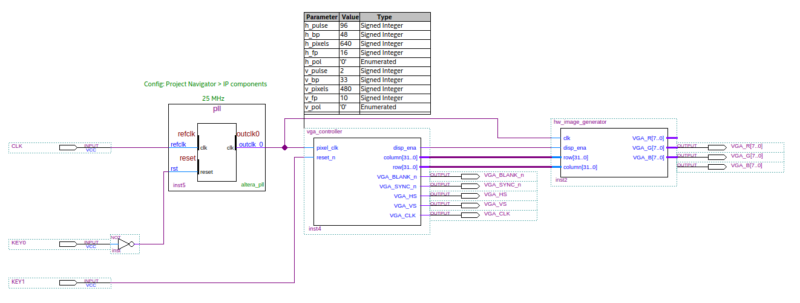

Test pattern generator
-----

### Features

* Generates a test pattern for VGA (640 x 480 @60 Hz)
* Includes a verilog testbench for hw_image_generator_tb

### Sources of information

* https://www.digikey.com/eewiki/pages/viewpage.action?pageId=15925278
* https://www.fpga4fun.com/HDMI.html
* VGA 64 colors test v3 by  Antonio Sánchez  for the Chameleon 96 Group

### Considerations

This tutorial has been made with this software setup:

* Quartus lite & EDS 17.1

  There shouldn't be any major problem for following this tutorial with other versions of Quartus.

### Block diagram
