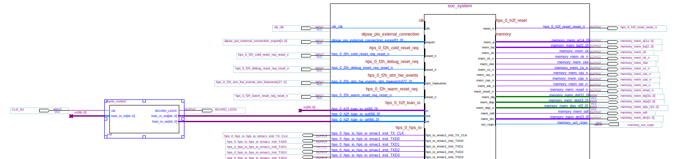
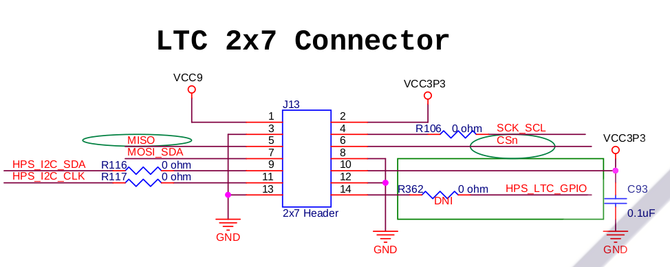
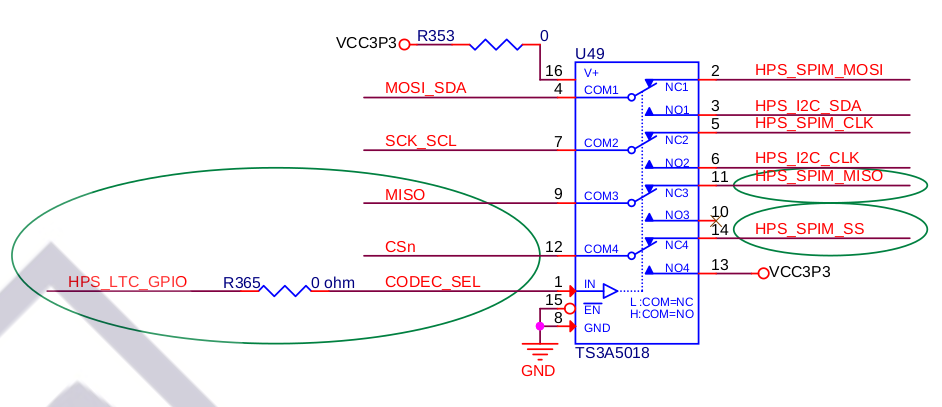

Control pins from LTC connector
-----

### Objectives

* Use pins from LTC connector as LoanIO pins that can be controlled by FPGA

  This is in preparation for next project to control an GPIO expander by SPI from FPGA

### Resources of information

* [Hardware Lab 16](https://rocketboards.org/foswiki/pub/Documentation/ArrowSoCKitEvaluationBoard/SoCKIT_Materials_16.0.zip)
* [Chameleon96 loanio tutorials](https://github.com/SoCFPGA-learning/Chameleon96/tree/master/Tutorials)
* https://community.intel.com/t5/Nios-II-Embedded-Design-Suite/GPIO-on-LTC-for-de0-nano-soc-and-sockit/m-p/163431

### Considerations

* If you want to compile this project, first of all open soc_system.qsys and generate HDL.
* In loanio_control.v code It is described how everything is defined including pin locations and schematic signals to work with LoanIOs.

### Information 

LTC pins are all connected to HPS (ARM) side (see in schematics below that all the signals start with HPS_). In order to control them from FPGA side we have to declare them as LoanIO in Platform designer (Qsys).

#### Platform designer

I copied to my project the qsys project from /SoCKit_HW_Lab_16.0/soc_system.qsys and modified it.

See resources of information for detailed explanations on how to activate LoanIO outputs. Here I will just indicate the configuration needed in Qsys.

* Peripheral Pins tab: 
  * SPI Controllers:
    Change I2C1 pin: FPGA, mode: Full
    Peripheral Mux Table > Enable LoanIOs 51, 52
  * I2C Controllers:
    Change SPIM0 pin: FPGA, mode: Full
    Peripheral Mux Table > Enable LoanIOs 60, 59,58,58
  * Peripheral Mux Table > Enable LoanIO00  for controlling HPS_LTC_GPIO

* System contents
  * export spim0
  * connect i2cl_scl_in to clk
  * export i2c1
  * export h2f_loan_io

### Block diagram of top-level entity

### Schematics

Signal HPS_LTC_GPIO is connected to U49 selector circuit through R365 resistor
HPS_LTC_GPIO = 1 disables SPI and duplicates I2C at pins 4 & 7 at LTC connector
HPS_LTC_GPIO = 0 enables SPI comms at LTC connector
HPS_LTC_GPIO has to be selected by HPS GPIO00 / FPGA LOANIO00
If a zero Resistor were soldered in the place for R362 then selection could be made through LTC connector 

### 

