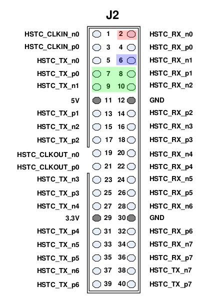
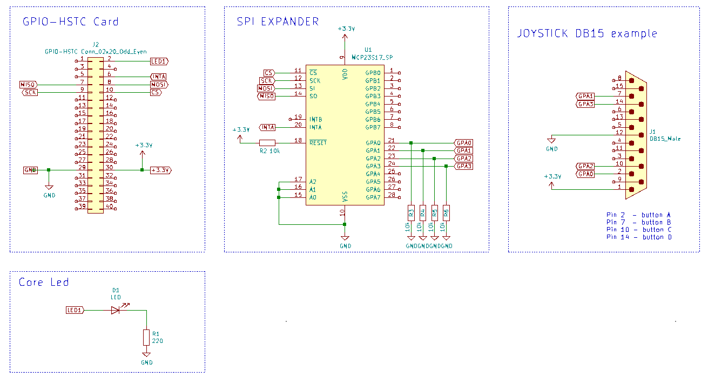

GPIO expander (connected to GPIO-HSTC Card)
-----

### Objectives and considerations

* Control an MCP23S17 SPI GPIO expander from FPGA side

In a following project I will connect the GPIO expander to the LTC connector from the Sockit board through LoanIO pins.  This way we will increase GPIO pins from 0 to 16+2 (or 16+16+2 with a second expander) (+2 are the I2C pins which could be used as GPIO or it could also be added a third gpio expander, so 16+16+16).

As development is much easier without having to rely on HPS resources, I tested the SPI communication with the help of a GPIO-HSTC Card.

### Resources of information

* https://github.com/ranzbak/aars_joystick  SPI master and joystick controller (Xilinx project)

* MCP23S17 datasheet 

* https://allpinouts.org/pinouts/connectors/input_device/joystick-pc-gameport/ Pinout joystick PC DB15

  

### Development

I took the github aars_joystick project and ported it from Xilinx to Altera. Basically I just had to remove the Xilinx PLL clock for the Altera PLL equivalent, change pins locations and changed some names of modules, ports and wires.   

Check the original code if you intend the use it with two joysticks as I made minor changes to it, because I just had at hand a DB15 PC joystick from which I just tested 4 buttons and monitored the pressing with the 4 fpga onboard leds.  I also removed the pull-up resistors defined in mcp23s17_input.v.

I connected an MCP23S17 to a breadboard and using Dupont wires I interfaced it with the FPGA through  the GPIO-HSTC Card.  I used the connector pictured and the pins listed below:

| color | J2 pin | HSTC signal | Sockit signal | GPIO  | Sockit PIN | Verilog signal | logic anal. | MCP23S17 DIP PIN |
| ----- | ------ | ----------- | ------------- | ----- | ---------- | -------------- | ----------- | ---------------- |
| BN    | 2      | HSTC_RX_n0  | HSMC_RX_n16   | GPIO1 | F14        | CORE_LED       | 4           |                  |
| --    | 5      | HSTC_TX_n0  | HSMC_TX_n16   | GPIO4 | A13        |                |             |                  |
| WH    | 6      | HSTC_RX_n1  | HSMC_RX_n15   | GPIO5 | G13        | JS_INTA        |             | 20               |
| VI    | 7      | HSTC_TX_p0  | HSMC_TX_p16   | GPIO6 | B13        | JS_MISO        | 0           | 14               |
| GY    | 8      | HSTC_RX_p1  | HSMC_RX_p15   | GPIO7 | H14        | JS_MOSI        | 1           | 13               |
| GN    | 9      | HSTC_TX_n1  | HSMC_TX_n15   | GPIO8 | B11        | JS_SCK         | 2           | 12               |
| BU    | 10     | HSTC_RX_n2  | HSMC_RX_n14   | GPIO9 | E13        | JS_CS          | 3           | 11               |
|       | 29     | 3.3V        |               |       |            |                |             | 9                |
|       | 30     | GND         |               |       |            |                |             | 10               |

### Schematic

