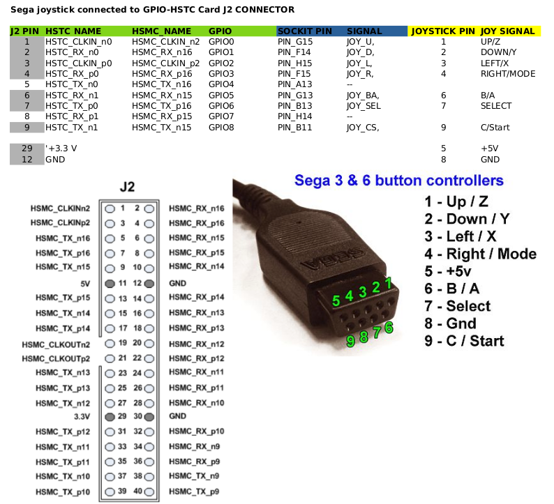

Sega joystick connected to GPIO-HSTC Card
-----

### Objectives and considerations

* Test a Sega controller ( 3 or 6 buttons) connected to the GPIO-HSTC card. 
* With each button pulsation a led is switched on (each user led corresponds to 3 different buttons)

### Resources of information

* https://github.com/ranzbak/aars_joystick  SPI master and joystick controller (Xilinx project)
* Control module for Megadrive DB9 Splitter of Antonio Villena by Aitor Pelaez (NeuroRulez)
  Based on the module written by Victor Trucco and modified by Fernando Mosquera
  https://github.com/MiSTer-DB9/NeoGeo_MiSTer/blob/master/src/joydb9md.v
* Description of genesis controller pdf from https://sites.ualberta.ca/~delliott/cmpe490/appnotes/2016w/g6_genesis_controllers/

Gracias a Fernando por su ayuda.

### Connections

 [GPIO-HSTC.ods](./GPIO-HSTC.ods)

