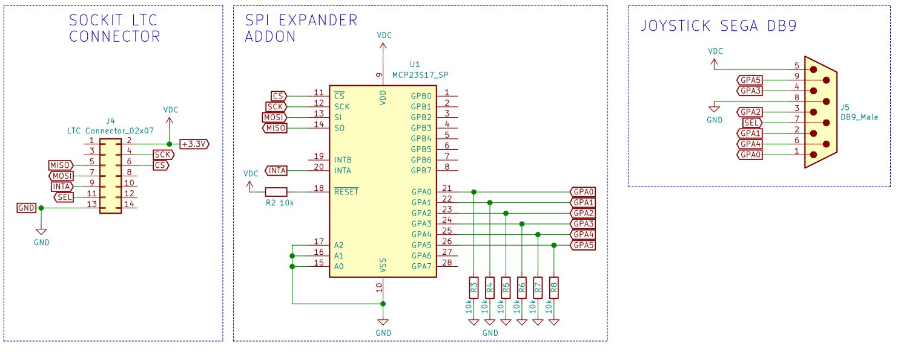
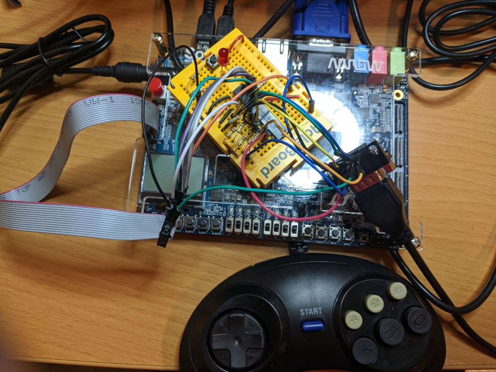

SPI GPIO expander (connected to the LTC connector)
-----

### Objectives

* Control an MCP23S17 SPI GPIO expander from FPGA side, using the pins available at the LTC connector from the Sockit board through LoanIO pins.  This way we will increase GPIO pins on SoCKit board from 0 to 16+2 (or 16+16+2 with a second expander) (+2 are the I2C pins which could be used as GPIO or it could also be added a third gpio expander, so 16+16+16).
* Test a Genesis Sega 6-button controller

### Resources of information

* [Hardware Lab 16](https://rocketboards.org/foswiki/pub/Documentation/ArrowSoCKitEvaluationBoard/SoCKIT_Materials_16.0.zip)
* [Chameleon96 loanio tutorials](https://github.com/SoCFPGA-learning/Chameleon96/tree/master/Tutorials)
* https://community.intel.com/t5/Nios-II-Embedded-Design-Suite/GPIO-on-LTC-for-de0-nano-soc-and-sockit/m-p/163431
* https://github.com/ranzbak/aars_joystick  SPI master and joystick controller (Xilinx project)
* MCP23S17 datasheet 
* Control module for Megadrive DB9 Splitter of Antonio Villena by Aitor Pelaez (NeuroRulez) Based on the module written by Victor Trucco and modified by Fernando Mosquera https://github.com/MiSTer-DB9/NeoGeo_MiSTer/blob/master/src/joydb9md.v
* Description of genesis controller pdf from https://sites.ualberta.ca/~delliott/cmpe490/appnotes/2016w/g6_genesis_controllers/
* Previous projects:
  * https://github.com/SoCFPGA-learning/SoCKit/tree/main/Projects/3.0.LTC_connector_Loanio
  * https://github.com/SoCFPGA-learning/SoCKit/tree/main/Projects/3.1.gpio_expander
  * https://github.com/SoCFPGA-learning/SoCKit/tree/main/Projects/3.2.gpio_sega

### Considerations

This project is the end result from previous projects listed above, so have a read at their readme.md:

* Project 3.0  working with loanIOs to access the pins of LTC connector from FPGA.  You need to assign the loanIOs in Platform Designer (Qsys). A bootloader is needed to be generated in order to assign those pins to FPGA during bootup process. This project shows the jumper & switches configuration needed.

* Project 3.1. getting to work the SPI GPIO expander with direct GPIO from HSTC board. In this part we only concentrate in working with the SPI GPIO expander and test it with a PC Jostick.

* Project 3.2. working with the Sega controller on direct pins of HSTC board. 

  

### Block diagram of top-level entity

### Schematics

 [GPIO_expander_sockit schematic pdf](GPIO_expander.pdf) 

 [LTC-Sega-Connections.ods](LTC-Sega-Connections.ods) 

### Main parts BOM

* 1 ut. ready made flat ribbon cable with standard connectors (2.0 mm pitch 14 pin (2x7) Flat Ribbon Data Cable for IDC [(buy link))](https://es.aliexpress.com/item/1005001609398146.html)                              

* 1 ut. special 2x7 pin 2.0 mm connector for Sockit board (Conn IDC Connector RCP 14 POS 2mm IDT RA Cable Mount Box/Tray [(buy link)](https://www.arrow.com/en/products/1-111623-9/te-connectivity?q=1-111623-9))

* 1 ut IC I/O EXPANDER SPI 16B 28SDIP  (part MCP23S17-E/SP-ND) [(buy link)](https://www.mouser.es/ProductDetail/Microchip-Technology/MCP23S17-E-SP/?qs=%2Fha2pyFadujGtHimLqIg4AmW4vCSvXf1nM4oOC77TXAIdYVbFt74Gw%3D%3D)

* 1 ut DB9 female connector

  

### Learnings

* Test first with direct GPIOS and understand how it works. Then progress to work with GPIO expanders.
* When working with breadboards, work with lower frequencies. In this case 5 Mhz PLL was used for the SPI communication.
* When something fails, sometimes it's very useful to disassemble everything and connect it again.

### Picture of final assembly

