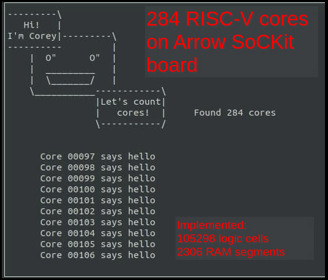

CoreScore - 284 RESV cores (Risc-V)
-----

### Info 

CoreScore is an award-giving benchmark for FPGAs and their synthesis/P&R tools. It tests how many [SERV](https://github.com/olofk/serv) cores that can be put into a particular FPGA.

I've adapted the corescore core from http://corescore.store/ to work with the target sockit. 

1) Flash .sof file

2) Run the corecount utility (Might need to adjust for the correct UART port and install python libraries)

```
python corecount.py
```


### Resources of information

* http://corescore.store/ original code and instructions
* https://github.com/somhi/corescore  added sockit target

### Corecount.py output

### 