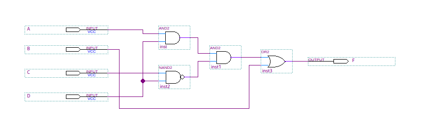

Logic circuit & Simulation
-----

### Features

* Build a digital logic schematic in the block editor
* Simulate it
* Test with real hardware (4 slides & led)

### Sources of information

* https://www.youtube.com/watch?v=uSGsQjXWnXk
* Sockit telegram Group (credits to Fernando)

### Considerations

This tutorial has been made with this software setup:

* Quartus lite & EDS 17.0

  There shouldn't be any major problem for following this tutorial with other versions of Quartus.

### Block diagram

### IO assignment

* SW0 = A, SW1 = B, SW2 = C, SW3 = D
* LED0 = F