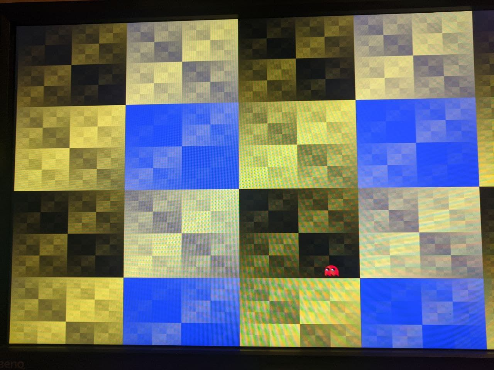

Fantasmita rebotando (from McLeod)
-----

### Objectives

* Play with graphics modes

### Sources of information

* http://www.forofpga.es/viewtopic.php?f=32&t=40    Code from McLeod and instructions 
* Sockit telegram Group (adapted to SoCKit by Fernando)

### Notes 

* Open project file from ./Sockit/fantasma_pacman_rebotando_sockit.qpf
* Fernando:
  Pon este Modeline  el de 720x576 50 Hz a 31.25 kHz
  ModeLine "720x576" 27.00 720 732 796 864 576 581 586 625 -HSync -VSync
  pero has de hacer los cambios que te indican y cambiar el reloj a 27.00 Mhz en vez de los 25.00 que tiene
  para la lista de Modelines , aqui teneis un huevo: https://www.mythtv.org/wiki/Modeline_Database

### Salida

